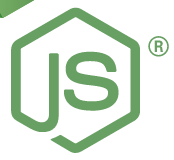

# ⚡️ Guia Rápido sobre o SQLite3 Usando Node JS:

- [Conexão com o Banco de Dados Sqlite3](#select)
- [Insert](#pushpin-insert-)
- [Select](#pushpin-select-)
- [Update](#pushpin-update-)
- [Delete](#pushpin-delete-)
- [REFERÊNCIAS](#referencia)


> ## :pushpin: Pré-requisito:

- Node Js [Download](https://nodejs.org/en/download/)

> ## :pushpin: Instalação:

Após instalar o Node, você deve instalar o pacote `sqlite3` na **pasta do seu projeto:**

```git
npm install sqlite3
```


> ## :pushpin: Conexão com o Banco de Dados Sqlite3

```javascript
//Importa o sqlite3
const sqlite3 = require('sqlite3').verbose();

//Cria a conexão:
let db = new sqlite3.Database('./db/mydb.db', (err) => {
  if (err) {
    console.error(err.message);
  }
  console.log('Conectado ao banco de dados');
});
```
> ## :pushpin: Insert
```javascript
let languages = ['C++', 'Python', 'Java', 'C#', 'Go'];
 
// construct the insert statement with multiple placeholders
// based on the number of rows
let placeholders = languages.map((language) => '(?)').join(',');
let sql = 'INSERT INTO langs(name) VALUES ' + placeholders;
 
// output the INSERT statement
console.log(sql);
 
db.run(sql, languages, function(err) {
  if (err) {
    return console.error(err.message);
  }
  console.log(`Rows inserted ${this.changes}`);
});
 
// close the database connection
db.close();
```

> ## :pushpin: Select

```javascript
db.serialize(() => {
  db.each(`SELECT PlaylistId as id,
                  Name as name
           FROM playlists`, (err, row) => {
    if (err) {
      console.error(err.message);
    }
    console.log(row.id + "\t" + row.name);
  });
});
```


> ## :pushpin: Update
```javascript
//
let data = ['Ansi C', 'C'];
let sql = `UPDATE langs
            SET name = ?
            WHERE name = ?`;
 
db.run(sql, data, function(err) {
  if (err) {
    return console.error(err.message);
  }
  console.log(`Row(s) updated: ${this.changes}`);
 
});
 
// close the database connection
db.close();
```


> ## :pushpin: Delete

```javascript
let id = 1;
// delete a row based on id
db.run(`DELETE FROM langs WHERE rowid=?`, id, function(err) {
  if (err) {
    return console.error(err.message);
  }
  console.log(`Row(s) deleted ${this.changes}`);
});
 
// close the database connection
db.close((err) => {
  if (err) {
    return console.error(err.message);
  }
});
```
---
## REFERÊNCIAS
**Appropriate Uses For SQLite**<BR/>
https://www.sqlite.org/whentouse.html<BR/>
**SQLite Node.js**<BR/>
https://www.sqlitetutorial.net/sqlite-nodejs/delete/